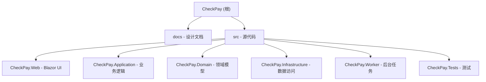

# CheckPay - 收款系统

## 变更记录 (Changelog)

- **2026-05-05** - 支票 **`bank_name`**：`ScoreBankNameCandidate` **剔除独立日期整行**（`LooksLikeDateOnlyPrintedLine`）；`BankNameMicrAdjacentAuxRegion` **minNormY 0.28**；短品牌加权 **0.28~0.78**；对 **`… , N.A.`**（National Association）落款加权；对 **LLC/INC** 且无 `bank`/`credit union`/`, N.A.` 线索的左上候选降权（避免付款商号盖住 Wells Fargo 类落款）；单测 `ParseBankName_RejectsStandaloneDate_when_LegalBankSitsInMicrAdjacentGapBand`、`ParseBankName_RejectsPrintedFractionalTransitForChaseStyleLayout`、`ParseBankName_PrefersWellsFargoNaOverPayeeLlcInPriorRegion`
- **2026-05-04** - **客户主数据**：`customers.expected_routing_number`（默认 `''`）与 `customer_code` **复合唯一**；支票上传/复核 `SyncCustomerPhoneFromMasterAsync`、`GetCustomerMatch`、`ResolveCustomerAsync` 按 **账号 + 9 位 ABA** 匹配（Routing 非 9 位数字时仍只匹配未填 ABA 的旧客户）；客户管理列表/CSV/新增编辑对话框支持 **ABA路由号**；迁移 `AddCustomerExpectedRoutingNumber`；单测 `CustomerCsvImportExportTests.Parse_rejects_duplicate_code_and_routing_combo_in_file`
- **2026-05-04** - MICR **两行断开**：`TryResolveMicrLineRawFromLayout` 在按路由过滤行后按 **normY ≤ 0.14** 并入相邻磁墨行（避免第二行不含 ABA 子串被丢弃）；`ParseMicrHeuristic` **仅**在含 **⑈/⑆** 的行内折叠数字间空格（不误伤三连数字正文行）；已命中 **⑆ABA⑆** 但括号分类失败且无非辅助命中时，若 **`firstOnUs` 未满 8 位**，则用路由块之后 **`≥7` 位数字 + ⑈** 尾段优先作账号（`RoutingSelectionMode` 仍为 `e13b_transit`，账号置信度 0.58）；单测 `TryResolveMicrLineRawFromLayout_MergesAdjacentMicrRowMissingRoutingSubstring`、`ParseMicrHeuristic_E13bTransit_TwoMicrRows_PrefersTransitTailSevenPlusDigitsOverShortBracket`
- **2026-05-04** - 支票 **`account_address`**（`ParseAccountAddress`）：**INC/LLC…** 行地址分降权；商号锚定 **窄纵带 + 上沿 cap**、宽商号 bbox 时 **左半幅** 取印刷地址；剔除 **`FOR INV`/`INV#`/`ACH RT`/`Deposit` 与磁墨**；锚定结果须含 **州邮编或门牌+街道词**；区域路径排除上述噪声且种子在「有地址提示」行取 **最高分**；`accountAddressPriorRegion.minNormY` **0.06**、`yLink` **0.36**；单测 `ParseAccountAddress_RejectsForInvPayeeAndMicrOutsidePrintedBand` 等
- **2026-05-04** - **复制到剪贴板**（支票上传 / 扣款导入「复制全部」）：`navigator.clipboard` 在非 HTTPS（如内网 `http://host:8080`）下不可用；`_Layout.cshtml` 新增 `checkPayCopyText`，优先 `clipboard.writeText`，失败则 `textarea` + `document.execCommand('copy')` 降级；`CheckUpload` / `DebitImport` 改为调用该函数
- **2026-05-04** - **ACH 支票导出**（`/reports/ach-us`）：表格首列行复选 + 表头 `TriState` 全选（仅当前查询结果中尚未 `AchDebitSucceeded` 的行）；「批量标为扣款成功」二次确认后批量写 `ach_debit_succeeded=Y` 与时间戳，并逐条 `AuditLog`（`BatchAchMark=true`）；查询刷新时自动剔除已不在结果或已标 Y 的勾选
- **2026-05-04** - **收款记录**已提交票面编辑：`CheckRecordSubmittedEditDialog` 弹框编辑支票号/金额/日期/客户与手机号/ACH 与抬头等（与上传入库字段对齐）；**仅** `SubmittedAt` 已填且 **`AchDebitSucceeded` 为 false** 时可编辑；`Sales,USFinance,Admin`；同银行支票号唯一校验、主数据与公司名警告重算、`AuditLog` 更新；列表「操作」列与抽屉「编辑票面信息」入口；设计文档 [docs/收款系统_页面交互设计_V1.0.md](docs/收款系统_页面交互设计_V1.0.md) 增补 4.2.1
- **2026-05-04** - **收款记录**（`/records`）与**客户管理**（`/customers`）：列表改为数据库分页（`Count` + `Skip`/`Take`），表格下展示总条数、每页 10/20/50 与 `MudPagination`；收款记录在抽屉内操作后通过 `RefreshSelectedRecordAsync` 按 ID 重载详情，避免当前页不含该行时详情丢失
- **2026-05-04** - 公司名称 Vision：`companyNamePriorRegion` 默认约 `normY 0~0.62`；`ParseCompanyName` 用 **区域 ∪ 上半带** 并集候选，仍无合格命中时按 **`FullText` 行序** 造伪 bbox 再打分（应对 Read 将 `168 … INC.` 的 `normY` 标到带外）；**bank/credit union** 且无高档法人后缀 0 分；`ScoreAccountHolderCandidate` 剔付款行；**prebuilt** `PayerName` 同 **BankName** 或为付款行则不覆盖持有人；**训练纠偏** 对样本 `CompanyName` 用 `ShouldSkipDiPayerNameForAccountHolder` 拒绝误写成付款行；单测 `ParseCompanyName_UsesFullTextLineOrderWhenGeometryExcludesIncLine` 等；排查 [docs/支票OCR失败排查.md](docs/支票OCR失败排查.md)
- **2026-05-04** - 支票上传/复核/菜单/首页/收款记录草稿区：授权角色统一为 **`Sales,USFinance,Admin`**（`CheckUpload` / `CheckReview` / `NavMenu` / `Index` / `CheckRecords` 草稿块），销售与美国财务均可进入上传与复核流程；设计文档 [docs/收款系统_页面交互设计_V1.0.md](docs/收款系统_页面交互设计_V1.0.md) 导航表同步
- **2026-05-04** - 支票上传/复核：OCR 写入或变更「客户账号」或 **Routing Number** 后，按 **账号 + 9 位 ABA**（`customers.customer_code` + `customers.expected_routing_number`）查询并自动带出主数据手机号（`SyncCustomerPhoneFromMasterAsync`，Routing 失焦亦触发）；仅在手机号为空或「账号+ABA」相对上次自动带出已变更时覆盖；OCR 完成轮询预填在 UI 线程 `InvokeAsync` 内执行；删除未使用的 `CheckReview.ApplyOcrResult`
- **2026-05-04** - 支票上传/复核：`Account Type`、`Pay to the order of` 下拉默认选中首项（`Business Checking` / `CHEUNG KONG…ALLIANCE FOOD GROUP`），移除「（请选择）」占位；`CheckUpload` 清空表单与 OCR 预填在仍为默认首项时允许被识别结果覆盖；`CheckReview` 复核从 OCR 拉取后对 Pay to 做目录归一、空值回退首项
- **2026-05-04** - 支票 Vision 金额兜底：当未开启 `Ocr:PrebuiltCheck:EnrichPrimaryResult` 且 Vision 金额 `≤0` 或置信度 `<0.52` 时，额外调用 `prebuilt-check.us`，仅在 `NumberAmount` 置信度 `≥0.6` 时覆盖金额；`Diagnostics` 增加 `prebuilt_check_amount_fallback`（`off`/`skipped`/`applied`/`empty`/`failed`）；配置 `Ocr:PrebuiltCheck:AmountFallbackWhenVisionFails`（默认 true，显式 `false` 关闭）；Compose `.env.example` 对应 `OCR_PREBUILT_CHECK_AMOUNT_FALLBACK_WHEN_VISION_FAILS`；文档 [docs/支票OCR失败排查.md](docs/支票OCR失败排查.md)
- **2026-04-30** - 地址字段抗干扰增强：`ParseAccountAddress` 合并相邻地址行时新增 `ShouldIncludeInAddressBlock` 过滤，剔除大写金额英文行（`thousand/hundred/dollars/only` 等）与非地址噪声，避免“金额行写在地址上方”被拼进 `AccountAddress`；新增单测 `ParseAccountAddress_IgnoresNearbyAmountWordsLine`
- **2026-04-30** - 上传/复核页金额校验提示优化：当 `AmountValidationResult.IsConsistent=true` 但 `LegalAmountRaw` 未含英文大写金额文本（仅数字/符号）时，不再提示“手写金额校验一致”，改为“未识别到大写金额文本，需手动校验金额”；`CheckUpload.razor` 与 `CheckReview.razor` 同步生效（保留最后校验时间）
- **2026-04-30** - 支票 Vision Read 解析：`CheckOcrVisionReadParser` 优先从 E13B transit 符号 `⑆9位路由⑆`（允许符号与数字间空格）提取 ABA；MICR 支票号支持末行 `数字…⑈`（取最后一处 on-us，最长 17 位）；印刷号候选排除「州 + 5 位邮编 + 可选 ZIP+4」行及扩展后 4 位；**MICR 区内若无 `⑆/⑈` 磁墨行则不信该区 `aba_sliding_window`/legacy 路由**，回退全文以免日期/金额拼成假 ABA；多段 ABA 时滑动窗仍优先带 `⑆` 定界符的窗；日期 `TryParse` 用 `InvariantCulture`；银行名过滤抬头碎片及「城市, ST 邮编」整行（无 `bank` 字样时）；**`micr_line_raw`**：`AzureOcrService` 优先 `TryResolveMicrLineRawFromLayout`（按行自下而上、可筛路由），其次 `TryBuildMicrLineRawFromPlainText`，最后才用启发式 `MicrLineRaw`；`Diagnostics` 增加 `micr_line_raw_source`（`layout`/`plain`/`heuristic`/`none`）
- **2026-04-30** - MICR ⑆ 两侧 on-us 数字：`TryAssignMicrCheckVsAccountByLength` 仅当 `max(左,右)≥10` 时按位数启发式区分支票号与账号（如 Wells `002594` + `2078288384`）；更短两侧（如 Chase 6+9）不启用以免互换；印刷号通道过滤「ABA 去前导 0」误读（如 `061000227`→`61000227`）；`CheckOcrRoutingMicrEuTests` 覆盖上述；`ReviewStatusFlowTests.ConfirmReview_ShouldCreateAuditLog` 入库前种子管理员用户以匹配 `AuditLogService` 无 actor 则跳过写入的行为
- **2026-04-30** - 支票号 `61000227` 误作印刷票号：`LooksLikeMisreadRoutingDigits` 改为对照 **Read 全文**（不再仅用 MICR 区域串），避免区内未含 `⑆` 时漏过滤；`ParseCheckNumber` 合并 **MICR 区 + 全文磁墨行** 再抽 E13B 括号支票号；**E13B 括号支票号已命中**时拒绝无关高分印刷串；印刷候选在「与 MICR 支票号去前导 0 等价」时取 **更短展示形**（如 `2594` 优于 `002594`）；单测 `ParseCheckNumber_WellsMaconStyle_PrefersHeader2594_OverRoutingTrimArtifact`
- **2026-04-30** - MICR 断行补账号：`ParseMicrHeuristic` 在已命中 `⑆ABA⑆` 但无法匹配「⑈…⑈ ⑆…⑆ …」时，尝试 **紧接路由块之后** 的 `⑈?账号⑈支票号`（换行亦可；账号左侧 ⑈ 常被 Read 漏掉），账号置信度略降；`micr_selection_mode` 为 `e13b_transit_aux_on_us`；单测 `ParseMicrHeuristic_E13bTransit_NewlineThenAuxiliaryOnUs_AccountAndMode` / `ParseMicrHeuristic_E13bTransit_SameLineAuxiliaryOnUs_Account`
- **2026-04-30** - 支票 `bank_name`：`ParseBankName` 除左上 `bankNamePriorRegion` 外合并 **磁墨上方辅助带**（约 `normY 0.40~0.76`）内短行候选；`ScoreBankNameCandidate` 排除 **门牌+街道词**（含 `HIGHWAY/HWY/ROUTE`）、无 `bank` 字样且命中地址启发式的行、**Harland Clarke / Deluxe checks** 供应商行；长抬头多词无 `bank` 略降权；`AddressStreetTokens` 增补 `hwy/highway/rte/route`；单测 `ParseBankName_PrefersMicrAdjacentBrandOverHighwayAddressLine`、`ParseBankName_RejectsHarlandClarkeSupplierLine`
- **2026-04-29** - 美国支票 `CheckNumber` 识别增强：`CheckOcrVisionReadParser.ParseCheckNumber` 新增“逐行候选 + 右上区域几何评分”策略（优先 `PrintedCheckPriorRegion` / 右上高分候选），在 MICR 与印刷号冲突时允许高置信右上印刷号优先，并降低将金额/日期误判为票号的概率
- **2026-04-29** - 修复登录后首页加载慢：`/` Dashboard 统计由多次串行 `CountAsync` 收敛为聚合查询，并将 `CreatedAt.Date == UtcToday` 改为 `[todayStart, tomorrowStart)` 范围过滤，减少数据库往返并提升索引命中
- **2026-04-29** - 修复生产环境前端字体外链导致首屏卡顿：移除 `_Layout.cshtml` 中 `fonts.googleapis.com` 的 Roboto 依赖，改由 `site.css` 使用系统字体栈，避免外网不可达时阻塞样式加载
- **2026-04-29** - 大陆财务 `ACH 已扣款导出` CSV 增加 `CheckDate` 字段，导出列调整为 `CustomerCode, MobilePhone, CheckDate, DebitDate, Amount, InvoiceNumbers, CompanyName, PaymentPeriod, CheckNumber`
- **2026-04-29** - 美国财务 `ACH 支票导出` CSV 字段精简：仅保留 `UploadDate, CustomerCode, MobilePhone, CheckDate, BankName, RoutingNumber, AccountNumber, AccountHolderName, CheckNumber, Amount, AchDebitSucceeded`（“全部导出 / 扣款未成功导出”一致）
- **2026-04-29** - 修复重复支票校验缺陷：上传/复核统一 `CheckNumber` 规范化（`Trim + UpperInvariant`）并改为“同银行（`RoutingNumber`）内去重”（含软删除记录）；保存时新增唯一索引冲突兜底提示；数据库唯一索引改为 `upper(btrim(check_number)) + coalesce(btrim(routing_number),'')`，允许不同银行同票号并阻断大小写/首尾空格穿透
- **2026-04-29** - 启动慢定位修复：统一本地默认连接串与 Compose 凭据（`src/CheckPay.Web/appsettings.json` 默认 `admin/admin123`），避免本地启动阶段因数据库认证失败触发 `Program` 的 10 次重试（每次 3 秒）导致冷启动明显变慢
- **2026-04-28** - 支票上传/复核新增“人工复核完毕”按钮：当金额校验不一致经人工确认属于大小写误报时，可写入备注标记并解除提交阻断（保留原始校验结果与提示追溯）
- **2026-04-28** - 兜底修复“手动校验手写金额”失败：`CheckUpload` / `CheckReview` 在金额校验后写审计日志改为 `try/catch` 非阻断，审计失败仅记 `Warning` 日志，不再影响校验结果保存与页面提示
- **2026-04-28** - 修复“一键转草稿/手动金额校验”偶发保存失败：`AuditLogService` 不再写死 `SystemUserId=000...001`，改为优先使用当前登录用户 `ClaimTypes.NameIdentifier`（GUID）并校验存在性，缺失时回退到库内有效管理员/首个有效用户，避免 `audit_logs.user_id -> users.id` 外键冲突（`FK_audit_logs_users_user_id`）
- **2026-04-28** - MICR 看板分组增强：`/admin/ocr-training-insights` 新增“MICR 二次通道按 RTN/模板分组（Top 10）”，显示各组 OCR 完成量、首轮 ABA 失败量、二次通道命中率与 ABA 修复率，优先按 `template_id` 分组，缺失时回退 `routing_number_final/first_pass`
- **2026-04-28** - 管理端看板增强：`/admin/ocr-training-insights` 新增 MICR 二次通道统计（OCR 完成样本、二次命中率、ABA 修复率）与按天趋势，数据来自 `ocr_results.raw_result.Diagnostics`（`micr_bottom_band_second_pass_applied`、`routing_aba_checksum_ok_first_pass`、`routing_aba_checksum_ok`）
- **2026-04-28** - MICR 可观测性增强：`AzureOcrService` 在底部条带二次解析命中时输出结构化日志（首轮→最终路由/账号/模式），并在 `Diagnostics` 增加 `routing_number_first_pass/final`、`account_number_first_pass/final`、`routing_aba_checksum_ok_first_pass` 等键，便于按命中样本评估策略收益
- **2026-04-28** - MICR 二次通道上线：`Ocr:Micr:BottomBandSecondPassEnabled` / `BottomBandMinNormCenterY` 控制首轮 ABA 失败后的底部条带二次解析；`CheckOcrVisionReadParser.ParseMicrHeuristicBottomBand` 仅使用底部行并复用归一化+ABA 规则；`AzureOcrService` 诊断新增 `micr_bottom_band_second_pass_*` 键
- **2026-04-28** - MICR 解析增强：`CheckOcrVisionReadParser` 新增基于 `ReadOcrLayout + profile` 的 MICR 区域优先解析；增加 OCR 易错字符归一化（`O/0`、`I/1`、`S/5`、`B/8`）后再做 ABA/账号启发式；`AzureOcrService` 路由模板提示与主解析改用该路径，降低全图噪声对 Routing Number 的干扰
- **2026-04-28** - 支票 OCR 非金额字段增强：`CheckOcrParsingProfile` 新增 `bankNamePriorRegion` / `accountHolderPriorRegion` / `accountAddressPriorRegion`（支持模板覆盖）；`CheckOcrVisionReadParser` 新增 `BankName`/`AccountHolderName`/`AccountAddress` 区域候选评分解析；`AzureOcrService` 将上述字段与 `prebuilt-check.us`（含 `PayerAddress`）融合并输出对应置信度与来源诊断
- **2026-04-28** - 支票训练纠偏默认改为**即时生效**：`CheckAzureTrainingCorrectionClusterMinSamples` 默认 `1`、`CheckAzureTrainingCorrectionSampleMinAgeMinutes` 默认 `0`（同步 `appsettings.json` / `.env.example` / `docker-compose.yml` / README），以支持“提交入库自动样本后再次上传同票快速命中纠偏”
- **2026-04-28** - 修复支票上传/复核“提交入库”偶发保存失败：`CheckSubmitOcrTrainingSamplePageHelper` 去重查询改为可翻译的 `EF.Functions.Like`，避免 `Notes.Contains(..., StringComparison.Ordinal)` 在 EF Core 中触发 `could not be translated`
- **2026-04-28** - 美国财务 `ACH 支票导出`（`/reports/ach-us`）新增收款方筛选：支持二选一 **`CHEUNG KONG HOLDING INC`** / **`MAXWELL TRADING`**，查询与 CSV 导出结果保持一致；页面会记忆并恢复上次选择的收款方（`localStorage`）
- **2026-04-28** - 自动训练样本质量门控：支票上传/复核「提交入库」自动样本仅在**低置信字段被人工改正**时写入，减少噪声样本；默认纠偏模式 `Ocr:CheckAzureTrainingCorrectionMode` 由 `StrongOnly` 调整为 `Similarity`，并新增“**自动模板簇 + 生效延迟**”门槛（`ClusterMinSamples` / `SampleMinAgeMinutes` / `RequireTemplateMatch`），提升困难样本命中率与稳定性；纠偏日志新增字段级 `before -> after` 统计（命中模式、簇信息、变更字段数/明细），并按周期输出汇总日志 `CheckOcrTrainingCorrectionSummary`（命中率、平均改正字段数、Top 字段）；补充 `CheckSubmitOcrTrainingSamplePageHelperTests`、`CheckOcrParsedSampleCorrectorTests`
- **2026-04-28** - 新增管理员页面 `/admin/ocr-training-insights`（系统管理 → OCR 训练效果看板），按窗口展示自动样本占比、平均改正字段数、字段改正 Top、按天趋势；并在 README 说明日志关键字与页面入口
- **2026-04-27** - 支票自动训练样本增强：`Notes` 含 `ocrResultId`/`checkRecordId`；**去重**（`Ocr:Training:AutoSampleDedupByOcrResultId`）；**票型**写入 `OcrCheckTemplateId`（`ICheckOcrTemplateResolver`）；**日志** `Ocr:Training:AutoSampleLogVerbosity`（Minimal/Verbose/Off）；差异比较时 **MicrFieldOrderNote** 表单未填则按 OCR 值对齐，减少伪差异；集成测试 `CheckSubmitOcrTrainingSamplePageHelperTests`
- **2026-04-27** - 支票上传/复核 **仅「提交入库」** 成功后可选自动写入 `ocr_training_samples`（`Notes` 以 `auto:check-final-submit` 开头；`OcrRawResponse` 与标注页一致的复制面板格式）；草稿保存不写；配置 **`Ocr:Training:AutoSampleOnCheckSubmit`** / **`Ocr:Training:AutoSampleRequireDiff`**；Compose / `.env.example` 增加 `OCR_TRAINING_*`；`CheckAchExtensionData.EqualsForTraining` 供纠偏与样本差异共用
- **2026-04-27** - 支票 OCR 策略增强：MICR 启发式增加 **ABA 路由校验位**、底部三连数字行、尾部滑动窗；`OcrResultDto` 增加 **`Diagnostics`**（及 `Iban`/`Bic` 欧洲提示字段）；日志输出 `CheckOcrDiagnostics`；可选 **`Ocr:PrebuiltCheck:EnrichPrimaryResult`** 在同图再调 **prebuilt-check.us** 与 Vision Read 融合；文档 [docs/支票OCR失败排查.md](docs/支票OCR失败排查.md)；Compose / `.env.example` 增加 `OCR_PREBUILT_CHECK_ENRICH_PRIMARY_RESULT`
- **2026-04-27** - 手写金额校验：改用 `Azure.AI.DocumentIntelligence` 调用 **prebuilt-check.us**（v4 API 2024-11-30）；移除对已弃用模型名 `prebuilt-check` 的 `Azure.AI.FormRecognizer` 依赖，修复新 DI 资源上 **ModelNotFound / 404**；字段解析兼容 `WordAmount` / `NumberAmount`
- **2026-04-27** - Azure OCR：`Azure:DocumentIntelligence:DocumentAnalysisEndpoint` / `DocumentAnalysisApiKey` 可选，专用于手写金额校验（DI）；解决纯 Computer Vision Key 导致校验 401；Compose 支持 `AZURE_DOCUMENT_INTELLIGENCE_*`；`.env.example` / README 说明 Vision 与 DI 凭据可分离
- **2026-04-27** - 新增 Azure DI 双阶段金额校验：`OcrWorker` 在金额置信度低于阈值时触发 `ValidateHandwrittenAmountAsync`；新增 `amount_validation_status/result/error_message/validated_at` 字段与迁移；页面显示“数字金额 vs 手写金额”一致性提示；新增 `Ocr:AmountValidation:*` 配置；新增复核页/上传页“手动校验手写金额”按钮并写入审计日志
- **2026-04-27** - OCR 主路径切换为 **Azure AI Vision Read**：移除腾讯混元实现与依赖；`OcrWorker` 仅调用 Azure，结果写入 `ocr_results.raw_result`；未配置 Azure 时 OCR 任务失败并提示；双引擎 UI 已删除；`azure_*` 列保留兼容历史行；文档与 `.cursor/rules/sync-docs.mdc` 约定「改动同步更新文档」
- **2026-04-08** - 文档收敛：删除过时「技术栈架构决策」文档；根目录与 README 以 Docker Compose + 现有实现为准；不计划 Railway 验证与 Microsoft Entra SSO（`User.EntraId` / `entra_id` 仅为字段名，非联合登录）
- **2026-03-19 02:00:00** - OCR 训练标注页面上线：新增 OcrTrainingSample 实体、EF 迁移（含 Designer.cs）、/admin/ocr-training 页面（上传图片→自动OCR→对比标注→保存样本），NavMenu 管理员菜单新增入口；修复手写迁移缺少 Designer.cs 导致 EF Core 无法识别迁移的问题
- **2026-03-19 01:00:00** - OCR 预填 bug 修复：CheckUpload.razor 和 CheckReview.razor 移除置信度门控（≥0.60才填），改为始终预填识别值，置信度仅影响边框颜色；CleanJson 重写（支持从乱文本中提取第一个JSON对象）；DebitOcrPrompt 加强约束；GetDoubleConfidence 兼容范围字符串（如"0.40-0.55"）；OCR日志级别 Debug→Information（添加解析结果结构化日志）
- **2026-03-19 00:00:00** - OCR 识别率提升：重写 CheckOcrPrompt（Chain-of-Thought + MICR 行定位）、置信度改为 0.0-1.0 浮点数输出（兼容旧字符串）、模型名配置化（Ocr:Model）、OcrWorker 添加智能重试机制（最多 3 次，指数退避）、新增 AddOcrRetryCount 迁移
- **2026-03-18 23:54:00** - 混元OCR集成完成：修复本地MinIO图片访问问题（Base64方案）、添加图片代理端点、修复所有页面图片显示
- **2026-03-18 19:37:00** - Docker部署成功：解决Windows DNS解析问题，应用+PostgreSQL+MinIO完整运行，数据库迁移和种子数据初始化成功
- **2026-03-18 11:00:00** - 完成Docker部署配置：Dockerfile、docker-compose.yml、部署文档，支持一键部署（应用+PostgreSQL+MinIO）
- **2026-03-18 10:34:00** - 完成MinIO存储迁移：从Azure Blob Storage迁移到MinIO（S3兼容对象存储），支持私有环境部署
- **2026-03-16 10:15:00** - 完成认证系统增强：数据库账号+BCrypt密码、密码修改功能、会话滑动过期
- **2026-03-16 01:50:00** - 完成P5开发：简单Cookie认证（硬编码两个账户：admin/admin123, user/user123）
- **2026-03-16 01:35:00** - 完成P6开发：Azure Document Intelligence OCR集成，支持prebuilt-check模型识别
- **2026-03-16 01:20:00** - 完成P7开发：Azure Blob Storage集成，支持文件上传/下载/删除
- **2026-03-13 18:30:00** - 完成P0-P4开发：数据库迁移、用户管理、并发保护、审计日志
- **2026-03-13 10:45:10** - 重新初始化 AI 上下文，完善项目文档结构
- **2026-03-13 10:36:23** - 更新项目架构文档，新增页面交互设计文档
- **2026-03-12 23:21:18** - 初始化项目架构文档

## 项目愿景

CheckPay 是一个跨国收款数据采集系统，专为处理美国支票收款和银行扣款对账而设计。系统通过 OCR 技术自动识别支票信息，支持扣款记录导入和自动匹配，提供完整的收款核查和异常处理流程。

**核心价值**：
- 自动化支票信息采集，减少手工录入错误
- 智能匹配支票与扣款记录，快速发现异常
- 跨时区协作支持（美国财务 + 大陆财务）
- 完整的审计追踪和状态管理

## 架构总览

本项目采用 .NET 10 全栈不分离架构，使用 Blazor Server 实现前后端一体化开发。

### 技术栈

- **前端**: Blazor Server + MudBlazor（Material Design 组件库）
- **后端**: ASP.NET Core 10 + EF Core 10
- **数据库**: PostgreSQL 16
- **OCR**: Azure AI Vision Read（`AzureOcrService`，从 MinIO 读图后调用 Read API + 启发式解析支票/扣款字段）
- **存储**: MinIO（S3 兼容对象存储，支持私有部署）
- **认证**: Cookie认证 + BCrypt密码哈希（数据库账号）
- **部署**: Docker Compose（应用 + PostgreSQL + MinIO）
- **日志**: Serilog + Seq

### 架构特点

- **前后端不分离**: 一套 C# 代码库，SignalR 内置实时通信
- **私有部署**: Docker Compose 一键拉起应用、PostgreSQL、MinIO
- **异步处理**: 内存 Channel 队列 + Worker Service 处理 OCR 任务
- **乐观并发**: 关键表使用 row_version 防止并发冲突

## 模块结构图



## 模块索引

| 模块路径 | 职责 | 语言 | 状态 |
|---------|------|------|------|
| `docs/` | 数据库设计、页面交互设计文档（以代码与迁移为准） | 文档 | ✅ 参考用 |
| `src/CheckPay.Web` | Blazor Server UI 页面和组件 | C# | ✅ 已完成 |
| `src/CheckPay.Application` | 业务用例（Commands/Queries）和接口定义 | C# | ✅ 已完成 |
| `src/CheckPay.Domain` | 领域模型、实体、枚举、业务规则 | C# | ✅ 已完成 |
| `src/CheckPay.Infrastructure` | EF Core、仓储实现、Azure 客户端 | C# | ✅ 已完成 |
| `src/CheckPay.Worker` | OCR 异步任务处理 | C# | ✅ 已完成 |
| `src/CheckPay.Tests` | 单元测试和集成测试 | C# | ✅ 已完成 |

## 核心业务流程

### 流程一：支票采集（美国财务）
1. 上传支票图片 → MinIO（S3 兼容）
2. OCR 识别（Azure AI Vision Read，异步队列见 Web 进程内 `OcrWorker`）
3. 复核表单（置信度颜色标记：绿/橙/红）
4. 确认入库 → check_records 表（状态：待扣款）

### 流程二：扣款导入（美国财务）
1. 批量上传银行扣款扫描件
2. 左右分屏手动录入（客户编号、支票号、金额、日期、流水号）
3. 自动匹配支票记录（按支票号）
4. 匹配成功 → 状态更新为"待核查"；匹配失败 → 进入异常列表

### 流程三：核查确认（大陆财务）
1. Dashboard 查看待核查数量
2. 逐条核对支票与扣款信息
3. 确认无误 → 状态更新为"已确认"
4. 发现问题 → 标记"存疑"并填写原因

## 数据库设计要点

- **主键**: 全表使用 UUID v4
- **时区**: 所有时间字段存储 UTC（timestamptz）
- **软删除**: 核心表使用 deleted_at 标记
- **乐观并发**: check_records 和 debit_records 使用 row_version
- **审计日志**: audit_logs 表记录所有关键操作

**核心表**：
- `check_records` - 支票记录
- `debit_records` - 扣款记录
- `ocr_results` - OCR 原始结果
- `customers` - 客户主数据
- `users` - 用户账号
- `audit_logs` - 审计日志

## 运行与开发

### 前置要求
- .NET 10 SDK
- PostgreSQL 16
- MinIO 服务器（本地或私有部署）
- **Azure AI Vision**（配置节 `Azure:DocumentIntelligence`：Endpoint + ApiKey），支票/扣款主 OCR；可选 `DocumentAnalysisEndpoint` / `DocumentAnalysisApiKey`（或 Compose `AZURE_DOCUMENT_INTELLIGENCE_*`）供手写金额校验（Document Intelligence）；未配置 Vision 凭据时 `IOcrService` 为 Mock，支票 Worker 会标记任务失败

### Docker Compose 部署（推荐）
```bash
# 克隆仓库
git clone <repository-url>
cd checkpay

# 一键启动所有服务（PostgreSQL + MinIO + Web应用）
docker-compose up -d

# 查看服务状态
docker-compose ps

# 查看应用日志
docker-compose logs -f web

# 访问应用
# Web应用: http://localhost:8080
# MinIO控制台: http://localhost:9001 (minioadmin/minioadmin)
# PostgreSQL: localhost:5433 (admin/admin123)

# 停止所有服务
docker-compose down

# 停止并删除数据卷（清空数据库和文件）
docker-compose down -v
```

**默认账号：**
- 管理员：admin@checkpay.local / admin123
- 美国财务：usfinance@checkpay.local / usfinance123
- 大陆财务：cnfinance@checkpay.local / cnfinance123

**Windows Docker Desktop DNS问题解决方案：**
如果遇到容器间DNS解析失败，docker-compose.yml已配置extra_hosts手动映射，无需额外操作。

### 本地开发（不使用Docker）
```bash
# 启动 MinIO
docker run -d \
  -p 9000:9000 \
  -p 9001:9001 \
  --name minio \
  -e "MINIO_ROOT_USER=minioadmin" \
  -e "MINIO_ROOT_PASSWORD=minioadmin" \
  minio/minio server /data --console-address ":9001"

# 恢复依赖
dotnet restore

# 配置环境变量（appsettings.Development.json）
# - ConnectionStrings__DefaultConnection
# - Minio__Endpoint / Minio__AccessKey / Minio__SecretKey / Minio__BucketName
# - Azure__DocumentIntelligence__Endpoint / Azure__DocumentIntelligence__ApiKey

# 运行数据库迁移
dotnet ef database update --project src/CheckPay.Infrastructure

# 启动应用
dotnet run --project src/CheckPay.Web
```

## 测试策略

待代码库建立后补充：
- 单元测试：领域模型、业务逻辑
- 集成测试：API 端点、数据库操作（Testcontainers）
- E2E 测试：关键业务流程

## 编码规范

- **架构模式**: 垂直切片 + 整洁架构
- **依赖方向**: Web → Application → Domain（Domain 不依赖任何层）
- **命名约定**: PascalCase（类/方法）、camelCase（参数/变量）
- **异步优先**: 所有 I/O 操作使用 async/await
- **错误处理**: Result 模式 + 全局异常中间件
- **日志**: 结构化日志（Serilog），审计事件单独 sink

## AI 使用指引

### 当前项目状态

- **阶段**: 核心功能已落地；文档为辅助，以本仓库代码为准
- **已完成**:
  - ✅ 数据库设计、页面交互设计（参考文档，实现见 `src/`）
  - ✅ P0: Solution结构、EF Core配置、数据库迁移
  - ✅ P1: 支票上传、OCR复核、状态写入（11个Razor页面）
  - ✅ P2: 扫描件上传、左右分屏录入、自动匹配、异常列表
  - ✅ P3: Dashboard、待核查列表、状态流转、存疑标记
  - ✅ P4: CSV导出、客户管理、用户管理、审计日志基础设施
  - ✅ P5: 简单Cookie认证（硬编码账户：admin/admin123, user/user123）
  - ✅ P6: Azure Document Intelligence OCR集成（prebuilt-check模型）
  - ✅ P7: MinIO存储集成（从Azure Blob Storage迁移，支持私有部署）
  - ✅ P8: 认证系统增强（数据库账号+BCrypt、密码修改、会话滑动过期）
  - ✅ P9: Docker部署配置（Dockerfile、docker-compose.yml、完整部署验证）
  - ✅ P10: ~~腾讯混元 OCR~~（**已弃用，2026-04-27 起由 Azure Vision Read 取代**；图片代理端点仍用于全站 MinIO 图片展示）
  - ✅ P11: OCR 识别率与稳定性（历史含混元 Prompt/重试；**当前**为 Azure 解析 + `OcrWorker` 重试与训练样本纠偏 `CheckOcrParsedSampleCorrector`）
  - ✅ P12: OCR训练标注页面（/admin/ocr-training，上传→识别→标注→保存样本，积累训练数据）
- **不在计划内**: Microsoft Entra 联合登录（SSO）、Railway 作为目标部署平台的验证与文档化（仓库根目录可见历史 `railway.json`，不作推荐路径）

### 与 AI 协作建议

1. **阅读资料**（与代码交叉核对）
   - 本文档「架构总览」「运行与开发」— 反映当前主推的 Docker Compose 形态
   - `docs/收款系统_数据库设计_V1.0.md` — 与 `src/CheckPay.Infrastructure/Migrations` 对照
   - `docs/收款系统_页面交互设计_V1.0.md` — UI/UX 与交互流程
   - 变更行为或配置时，同步更新 `README.md`、本文档及 `.env.example` / `docker-compose` 等（见 `.cursor/rules/sync-docs.mdc`，无需用户提醒）

2. **维护优先级（按需）**
   - 缺陷修复与业务小需求
   - 审计日志查询界面、导出增强等增强项（无强制路线图编号）

3. **代码生成原则**
   - 遵循设计文档中的架构决策
   - 数据库操作必须符合数据库设计规范
   - UI 组件必须符合页面交互设计规范
   - 优先使用 MudBlazor 组件库
   - 所有时间处理使用 UTC

4. **关键注意事项**
   - 支票号唯一性校验（实时）
   - 乐观并发控制（row_version）
   - OCR 置信度颜色规则（绿 ≥0.85 / 橙 0.60-0.85 / 红 <0.60）
   - 跨时区时间显示（前端转换）
   - 审计日志记录（所有状态变更）

### 关键文件

- `docs/收款系统_数据库设计_V1.0.md` - 数据库表结构设计参考（以迁移为准）
- `docs/收款系统_页面交互设计_V1.0.md` - 页面布局与交互流程设计
- `docker-compose.yml` - 本地/私有一体化部署
- `src/CheckPay.Infrastructure/Services/AzureOcrService.cs` - 支票/扣款 OCR（Azure Read + 启发式字段）
- `src/CheckPay.Worker/Services/OcrWorker.cs` - 支票 OCR 后台队列（由 Web 以 HostedService 注册同一类型）
- `.cursor/rules/sync-docs.mdc` - 约定：功能/配置变更时同步更新文档

### 成本与运维提示

- 自建 Docker 环境：主要成本为自有主机或与业务一致的托管方案；MinIO 与 PostgreSQL 随 Compose 自管。
- 使用 Azure AI Vision 等资源时，按 Azure 实际计费为准。

## 实施记录

### 2026-03-18 开发会话（晚上）

**完成内容：P10 腾讯混元OCR集成和图片显示修复**（**历史归档**：混元相关代码已于 2026-04-27 移除，当前实现见 `AzureOcrService`、`OcrWorker`。）

#### 1. 混元OCR本地MinIO图片访问问题修复（已移除）
**问题**：MinIO图片URL是本地路径（`http://localhost:9000/...`），混元API在腾讯云无法访问

**解决方案**（历史）：
- 从 MinIO 下载图片到内存，Base64 Data URI 调用混元

**修改文件**（历史）：
- ~~`src/CheckPay.Infrastructure/Services/HunyuanOcrService.cs`~~（已删除）

#### 2. 图片代理端点实现
**问题**：浏览器无法直接访问Docker容器内MinIO地址（`http://minio:9000/...`）

**解决方案**：
- 创建ImageProxyController.cs API端点
- 后端从MinIO下载图片并返回给浏览器
- 在Program.cs添加AddControllers()和MapControllers()

**新增文件**：
- `src/CheckPay.Web/Controllers/ImageProxyController.cs`

**修改文件**：
- `src/CheckPay.Web/Program.cs`

#### 3. 全页面图片显示修复
**修改页面**：
- `src/CheckPay.Web/Pages/CheckReview.razor`（复核页面）
- `src/CheckPay.Web/Pages/CheckRecords.razor`（收款记录详情）

**实现方法**：
```csharp
private string GetProxyImageUrl(string? imageUrl)
{
    if (string.IsNullOrEmpty(imageUrl)) return string.Empty;
    return $"/api/ImageProxy?url={Uri.EscapeDataString(imageUrl)}";
}
```

**当前系统状态**（已随架构演进更新）：
- ✅ 支票 OCR 由 Azure Vision Read 处理，结果存 `ocr_results.raw_result`
- ✅ 所有页面支票图片正常显示（代理端点）
- ✅ Docker Compose完整运行（PostgreSQL + MinIO + Web应用）

**下一步工作**：
1. 生产环境部署测试
2. 性能优化和监控
3. 用户培训和文档完善

---

### 2026-03-16 开发会话（下午）

**完成内容：P8 认证系统增强**

#### 1. 数据库账号迁移（Task #5）
- 添加User.PasswordHash字段到User实体
- 创建AddPasswordHashToUser数据库迁移
- 修改Program.cs添加种子数据逻辑
  - 三个默认用户：admin、usfinance、cnfinance
  - 使用BCrypt.Net-Next 4.1.0哈希密码
- 修改Login.razor使用数据库验证
  - 查询Users表验证EntraId和密码
  - 使用BCrypt.Verify验证密码哈希
  - 添加用户ID到Claims

#### 2. 密码修改功能（Task #6）
- 创建ChangePassword.razor页面（/change-password路由）
  - 验证当前密码
  - 验证新密码长度（最少6位）
  - 验证新密码与确认密码一致
  - 使用BCrypt哈希新密码并保存
- 在NavMenu.razor添加"修改密码"入口

#### 3. 会话超时管理（Task #7）
- 在Program.cs添加SlidingExpiration配置
  - 启用滑动过期机制
  - 用户活跃时自动延长会话

#### 4. Mock服务和测试
- 使用MockOcrService和MockBlobStorageService进行独立测试
- 61个单元测试全部通过

**当前系统状态：**
- ✅ 数据库认证：三个默认账号通过种子数据创建
- ✅ 密码安全：BCrypt哈希存储
- ✅ 密码管理：用户可自行修改密码
- ✅ 会话管理：8小时过期+滑动延长
- ✅ 测试覆盖：61个测试全部通过

**下一步工作（历史记录；多数已在后续迭代完成）：**
1. 审计日志查询界面
2. 数据导出增强（Excel、PDF）

### 2026-03-16 开发会话（上午）

**完成内容：P5 简单Cookie认证 + P6 Azure Document Intelligence OCR集成 + P7 Azure Blob Storage集成**

#### P5: 简单Cookie认证

1. **添加认证服务**
   - 在Program.cs添加Cookie认证配置
   - 配置登录路径/login，登出路径/logout
   - 会话有效期8小时

2. **创建登录页面**
   - 创建Login.razor（/login路由）
   - 硬编码两个账户：admin/admin123（管理员）、user/user123（普通用户）
   - 登录成功后创建ClaimsPrincipal并写入Cookie

3. **创建登出页面**
   - 创建Logout.razor（/logout路由）
   - 清除认证Cookie并重定向到登录页

4. **更新App.razor**
   - 添加CascadingAuthenticationState支持
   - 使用AuthorizeRouteView保护路由
   - 未认证用户自动重定向到登录页

5. **更新MainLayout**
   - 显示当前登录用户名
   - 添加登出按钮

#### P6: Azure Document Intelligence OCR集成

1. **添加Azure.AI.FormRecognizer依赖**
   - 在CheckPay.Infrastructure项目添加Azure.AI.FormRecognizer NuGet包（v4.1.0）
   - 在CheckPay.Tests项目添加Azure.AI.FormRecognizer NuGet包（用于测试）

2. **配置文件更新**
   - 更新appsettings.json，添加Azure:DocumentIntelligence配置节
   - 配置Endpoint和ApiKey参数

3. **实现AzureOcrService**
   - 使用DocumentAnalysisClient调用prebuilt-check模型
   - 实现ProcessCheckImageAsync：识别支票号、金额、日期
   - 提取置信度分数（CheckNumber、Amount、Date）
   - 自动类型转换（string→decimal、string→DateTime）

4. **单元测试更新**
   - 修改AzureOcrServiceTests，使用Mock配置而非真实连接
   - 添加构造函数参数验证测试（Endpoint和ApiKey缺失检查）
   - 所有9个单元测试通过

#### P7: Azure Blob Storage集成

1. **添加Azure.Storage.Blobs依赖**
   - 在CheckPay.Infrastructure项目添加Azure.Storage.Blobs NuGet包（v12.27.0）
   - 在CheckPay.Tests项目添加Azure.Storage.Blobs NuGet包（用于测试）

2. **配置文件更新**
   - 更新appsettings.json，添加Azure:BlobStorage配置节
   - 配置ConnectionString和ContainerName参数
   - 本地开发使用UseDevelopmentStorage=true（Azure Storage Emulator）

3. **实现AzureBlobStorageService**
   - 实现UploadAsync：支持文件上传，自动创建容器，生成唯一文件名（GUID前缀）
   - 实现DownloadAsync：支持通过URL下载文件流
   - 实现DeleteAsync：支持删除指定URL的文件
   - 添加GetContentType方法：根据文件扩展名自动识别MIME类型

4. **单元测试更新**
   - 修改AzureBlobStorageServiceTests，使用Mock配置而非真实连接
   - 添加构造函数参数验证测试（ConnectionString和ContainerName缺失检查）

**当前系统状态：**
- ✅ 简单Cookie认证完整实现（硬编码账户）
- ✅ Azure Document Intelligence OCR服务完整实现
- ✅ 支持prebuilt-check模型识别支票信息
- ✅ Azure Blob Storage服务完整实现
- ✅ 支持上传/下载/删除操作
- ✅ 单元测试：9个测试全部通过

**下一步工作：**
1. P8: 认证增强与 Docker 部署验证

---

### 2026-03-13 开发会话

**完成内容：P0-P4 基础架构和核心功能**

#### 1. 数据库迁移（Task #4）
- 修复CheckRecord和DebitRecord一对一关系配置
- 生成InitialCreate迁移，包含6张表完整结构
- 验证索引、外键、约束配置正确

#### 2. 用户管理页面（Task #5）
- 创建Users.razor（/users路由）
- 实现内联编辑、角色管理、启用/停用
- 邮箱与 entra_id 唯一性校验

#### 3. 并发保护（Task #6）
- 在5个关键页面添加DbUpdateConcurrencyException捕获
- CheckReview、DebitImport、ExceptionList、ReviewList、ReviewDetail
- 并发冲突时友好提示并重新加载数据

#### 4. 审计日志（Task #7）
- 创建IAuditLogService接口和AuditLogService实现
- 在ReviewDetail的确认/存疑操作中记录审计日志
- 使用硬编码系统用户ID（待认证完成后替换）

**当前系统状态：**
- ✅ 数据库迁移：6张表结构完整
- ✅ UI页面：11个Razor页面全部实现
- ✅ 并发控制：关键操作已保护
- ✅ 审计日志：基础设施就绪
- ✅ 单元测试：7个测试全部通过

**下一步工作（历史记录）：** 后续已实现 Cookie 认证、Azure DI、存储迁移至 MinIO、Docker Compose 与 OCR 管线等；OCR 主引擎现为 Azure Vision Read（见 2026-04-27 变更记录）。
