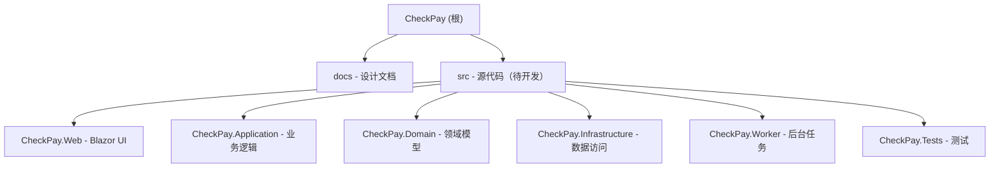

# CheckPay - 收款系统

## 变更记录 (Changelog)

- **2026-03-18 19:37:00** - Docker部署成功：解决Windows DNS解析问题，应用+PostgreSQL+MinIO完整运行，数据库迁移和种子数据初始化成功
- **2026-03-18 11:00:00** - 完成Docker部署配置：Dockerfile、docker-compose.yml、部署文档，支持一键部署（应用+PostgreSQL+MinIO）
- **2026-03-18 10:34:00** - 完成MinIO存储迁移：从Azure Blob Storage迁移到MinIO（S3兼容对象存储），支持私有环境部署
- **2026-03-16 10:15:00** - 完成认证系统增强：数据库账号+BCrypt密码、密码修改功能、会话滑动过期
- **2026-03-16 01:50:00** - 完成P5开发：简单Cookie认证（硬编码两个账户：admin/admin123, user/user123）
- **2026-03-16 01:35:00** - 完成P6开发：Azure Document Intelligence OCR集成，支持prebuilt-check模型识别
- **2026-03-16 01:20:00** - 完成P7开发：Azure Blob Storage集成，支持文件上传/下载/删除
- **2026-03-13 18:30:00** - 完成P0-P4开发：数据库迁移、用户管理、并发保护、审计日志
- **2026-03-13 10:45:10** - 重新初始化 AI 上下文，完善项目文档结构
- **2026-03-13 10:36:23** - 更新项目架构文档，新增页面交互设计文档
- **2026-03-12 23:21:18** - 初始化项目架构文档

## 项目愿景

CheckPay 是一个跨国收款数据采集系统，专为处理美国支票收款和银行扣款对账而设计。系统通过 OCR 技术自动识别支票信息，支持扣款记录导入和自动匹配，提供完整的收款核查和异常处理流程。

**核心价值**：
- 自动化支票信息采集，减少手工录入错误
- 智能匹配支票与扣款记录，快速发现异常
- 跨时区协作支持（美国财务 + 大陆财务）
- 完整的审计追踪和状态管理

## 架构总览

本项目采用 .NET 10 全栈不分离架构，使用 Blazor Server 实现前后端一体化开发。

### 技术栈

- **前端**: Blazor Server + MudBlazor（Material Design 组件库）
- **后端**: ASP.NET Core 10 + EF Core 10
- **数据库**: PostgreSQL 16
- **OCR**: Azure Document Intelligence（prebuilt-check 模型）
- **存储**: MinIO（S3 兼容对象存储，支持私有部署）
- **认证**: Microsoft Entra ID（OAuth2/OIDC）
- **部署**: Railway（应用 + 数据库）
- **日志**: Serilog + Seq

### 架构特点

- **前后端不分离**: 一套 C# 代码库，SignalR 内置实时通信
- **低成本运维**: Railway 部署，月费约 $17（较 Azure 全家桶节省 83%）
- **异步处理**: 内存 Channel 队列 + Worker Service 处理 OCR 任务
- **乐观并发**: 关键表使用 row_version 防止并发冲突

## 模块结构图



## 模块索引

| 模块路径 | 职责 | 语言 | 状态 |
|---------|------|------|------|
| `docs/` | 技术栈架构决策、数据库设计、页面交互设计文档 | 文档 | ✅ 已完成 |
| `src/CheckPay.Web` | Blazor Server UI 页面和组件 | C# | ✅ 已完成 |
| `src/CheckPay.Application` | 业务用例（Commands/Queries）和接口定义 | C# | ✅ 已完成 |
| `src/CheckPay.Domain` | 领域模型、实体、枚举、业务规则 | C# | ✅ 已完成 |
| `src/CheckPay.Infrastructure` | EF Core、仓储实现、Azure 客户端 | C# | ✅ 已完成 |
| `src/CheckPay.Worker` | OCR 异步任务处理 | C# | ✅ 已完成 |
| `src/CheckPay.Tests` | 单元测试和集成测试 | C# | ✅ 已完成 |

## 核心业务流程

### 流程一：支票采集（美国财务）
1. 上传支票图片 → Azure Blob Storage
2. OCR 识别（Azure Document Intelligence prebuilt-check）
3. 复核表单（置信度颜色标记：绿/橙/红）
4. 确认入库 → check_records 表（状态：待扣款）

### 流程二：扣款导入（美国财务）
1. 批量上传银行扣款扫描件
2. 左右分屏手动录入（客户编号、支票号、金额、日期、流水号）
3. 自动匹配支票记录（按支票号）
4. 匹配成功 → 状态更新为"待核查"；匹配失败 → 进入异常列表

### 流程三：核查确认（大陆财务）
1. Dashboard 查看待核查数量
2. 逐条核对支票与扣款信息
3. 确认无误 → 状态更新为"已确认"
4. 发现问题 → 标记"存疑"并填写原因

## 数据库设计要点

- **主键**: 全表使用 UUID v4
- **时区**: 所有时间字段存储 UTC（timestamptz）
- **软删除**: 核心表使用 deleted_at 标记
- **乐观并发**: check_records 和 debit_records 使用 row_version
- **审计日志**: audit_logs 表记录所有关键操作

**核心表**：
- `check_records` - 支票记录
- `debit_records` - 扣款记录
- `ocr_results` - OCR 原始结果
- `customers` - 客户主数据
- `users` - 用户账号
- `audit_logs` - 审计日志

## 运行与开发

### 前置要求
- .NET 10 SDK
- PostgreSQL 16
- MinIO 服务器（本地或私有部署）
- Azure 账号（Document Intelligence）
- Microsoft Entra ID 租户

### Docker Compose 部署（推荐）
```bash
# 克隆仓库
git clone <repository-url>
cd checkpay

# 一键启动所有服务（PostgreSQL + MinIO + Web应用）
docker-compose up -d

# 查看服务状态
docker-compose ps

# 查看应用日志
docker-compose logs -f web

# 访问应用
# Web应用: http://localhost:8080
# MinIO控制台: http://localhost:9001 (minioadmin/minioadmin)
# PostgreSQL: localhost:5433 (admin/admin123)

# 停止所有服务
docker-compose down

# 停止并删除数据卷（清空数据库和文件）
docker-compose down -v
```

**默认账号：**
- 管理员：admin@checkpay.local / admin123
- 美国财务：usfinance@checkpay.local / usfinance123
- 大陆财务：cnfinance@checkpay.local / cnfinance123

**Windows Docker Desktop DNS问题解决方案：**
如果遇到容器间DNS解析失败，docker-compose.yml已配置extra_hosts手动映射，无需额外操作。

### 本地开发（不使用Docker）
```bash
# 启动 MinIO
docker run -d \
  -p 9000:9000 \
  -p 9001:9001 \
  --name minio \
  -e "MINIO_ROOT_USER=minioadmin" \
  -e "MINIO_ROOT_PASSWORD=minioadmin" \
  minio/minio server /data --console-address ":9001"

# 恢复依赖
dotnet restore

# 配置环境变量（appsettings.Development.json）
# - ConnectionStrings__DefaultConnection
# - Minio__Endpoint / Minio__AccessKey / Minio__SecretKey / Minio__BucketName
# - Azure__DocumentIntelligence__Endpoint / Azure__DocumentIntelligence__ApiKey

# 运行数据库迁移
dotnet ef database update --project src/CheckPay.Infrastructure

# 启动应用
dotnet run --project src/CheckPay.Web
```

### Railway 部署
```bash
# 推送代码自动触发部署
git push origin main

# Railway 自动执行：
# 1. dotnet publish -c Release
# 2. 零停机滚动部署
# 3. 自动运行 EF Core 迁移
```

## 测试策略

待代码库建立后补充：
- 单元测试：领域模型、业务逻辑
- 集成测试：API 端点、数据库操作（Testcontainers）
- E2E 测试：关键业务流程

## 编码规范

- **架构模式**: 垂直切片 + 整洁架构
- **依赖方向**: Web → Application → Domain（Domain 不依赖任何层）
- **命名约定**: PascalCase（类/方法）、camelCase（参数/变量）
- **异步优先**: 所有 I/O 操作使用 async/await
- **错误处理**: Result 模式 + 全局异常中间件
- **日志**: 结构化日志（Serilog），审计事件单独 sink

## AI 使用指引

### 当前项目状态

- **阶段**: 开发阶段 → P0-P9 已完成
- **已完成**:
  - ✅ 技术栈架构决策、数据库设计、页面交互设计
  - ✅ P0: Solution结构、EF Core配置、数据库迁移
  - ✅ P1: 支票上传、OCR复核、状态写入（11个Razor页面）
  - ✅ P2: 扫描件上传、左右分屏录入、自动匹配、异常列表
  - ✅ P3: Dashboard、待核查列表、状态流转、存疑标记
  - ✅ P4: CSV导出、客户管理、用户管理、审计日志基础设施
  - ✅ P5: 简单Cookie认证（硬编码账户：admin/admin123, user/user123）
  - ✅ P6: Azure Document Intelligence OCR集成（prebuilt-check模型）
  - ✅ P7: MinIO存储集成（从Azure Blob Storage迁移，支持私有部署）
  - ✅ P8: 认证系统增强（数据库账号+BCrypt、密码修改、会话滑动过期）
  - ✅ P9: Docker部署配置（Dockerfile、docker-compose.yml、完整部署验证）
- **待完成**:
  - ⏳ Microsoft Entra ID集成（企业级SSO）
  - ⏳ Railway部署配置和测试

### 与 AI 协作建议

1. **阅读设计文档**（必读）
   - `docs/收款系统_技术栈架构决策_V1.0.md` - 了解技术选型和架构决策
   - `docs/收款系统_数据库设计_V1.0.md` - 了解数据模型和表结构
   - `docs/收款系统_页面交互设计_V1.0.md` - 了解 UI/UX 设计和交互流程

2. **开发优先级**
   - P0: Solution 结构、EF Core 配置、Railway 部署验证、Entra ID 接入
   - P1: 支票上传、OCR 识别、复核表单、状态写入
   - P2: 扫描件上传、左右分屏录入、自动匹配、异常列表
   - P3: Dashboard、待核查列表、状态流转、存疑标记
   - P4: Excel 导出、客户主数据、用户管理、审计日志

3. **代码生成原则**
   - 遵循设计文档中的架构决策
   - 数据库操作必须符合数据库设计规范
   - UI 组件必须符合页面交互设计规范
   - 优先使用 MudBlazor 组件库
   - 所有时间处理使用 UTC

4. **关键注意事项**
   - 支票号唯一性校验（实时）
   - 乐观并发控制（row_version）
   - OCR 置信度颜色规则（绿 ≥0.85 / 橙 0.60-0.85 / 红 <0.60）
   - 跨时区时间显示（前端转换）
   - 审计日志记录（所有状态变更）

### 关键文件

- `docs/收款系统_技术栈架构决策_V1.0.md` - 技术选型与架构决策
- `docs/收款系统_数据库设计_V1.0.md` - 数据库表结构与关系设计
- `docs/收款系统_页面交互设计_V1.0.md` - 页面布局与交互流程设计

### 月度成本估算

- Railway 应用: $5/月
- Railway 数据库: $5/月
- MinIO: $0（自托管）
- Azure Document Intelligence: $5/月（约 500 张支票）
- Microsoft Entra ID: $0（免费额度）
- **总计**: ~$15/月

## 实施记录

### 2026-03-16 开发会话（下午）

**完成内容：P8 认证系统增强**

#### 1. 数据库账号迁移（Task #5）
- 添加User.PasswordHash字段到User实体
- 创建AddPasswordHashToUser数据库迁移
- 修改Program.cs添加种子数据逻辑
  - 三个默认用户：admin、usfinance、cnfinance
  - 使用BCrypt.Net-Next 4.1.0哈希密码
- 修改Login.razor使用数据库验证
  - 查询Users表验证EntraId和密码
  - 使用BCrypt.Verify验证密码哈希
  - 添加用户ID到Claims

#### 2. 密码修改功能（Task #6）
- 创建ChangePassword.razor页面（/change-password路由）
  - 验证当前密码
  - 验证新密码长度（最少6位）
  - 验证新密码与确认密码一致
  - 使用BCrypt哈希新密码并保存
- 在NavMenu.razor添加"修改密码"入口

#### 3. 会话超时管理（Task #7）
- 在Program.cs添加SlidingExpiration配置
  - 启用滑动过期机制
  - 用户活跃时自动延长会话

#### 4. Mock服务和测试
- 使用MockOcrService和MockBlobStorageService进行独立测试
- 61个单元测试全部通过

**当前系统状态：**
- ✅ 数据库认证：三个默认账号通过种子数据创建
- ✅ 密码安全：BCrypt哈希存储
- ✅ 密码管理：用户可自行修改密码
- ✅ 会话管理：8小时过期+滑动延长
- ✅ 测试覆盖：61个测试全部通过

**下一步工作：**
1. Railway部署配置和测试
2. Microsoft Entra ID集成（可选）
3. 审计日志查询界面
4. 数据导出增强（Excel、PDF）

### 2026-03-16 开发会话（上午）

**完成内容：P5 简单Cookie认证 + P6 Azure Document Intelligence OCR集成 + P7 Azure Blob Storage集成**

#### P5: 简单Cookie认证

1. **添加认证服务**
   - 在Program.cs添加Cookie认证配置
   - 配置登录路径/login，登出路径/logout
   - 会话有效期8小时

2. **创建登录页面**
   - 创建Login.razor（/login路由）
   - 硬编码两个账户：admin/admin123（管理员）、user/user123（普通用户）
   - 登录成功后创建ClaimsPrincipal并写入Cookie

3. **创建登出页面**
   - 创建Logout.razor（/logout路由）
   - 清除认证Cookie并重定向到登录页

4. **更新App.razor**
   - 添加CascadingAuthenticationState支持
   - 使用AuthorizeRouteView保护路由
   - 未认证用户自动重定向到登录页

5. **更新MainLayout**
   - 显示当前登录用户名
   - 添加登出按钮

#### P6: Azure Document Intelligence OCR集成

1. **添加Azure.AI.FormRecognizer依赖**
   - 在CheckPay.Infrastructure项目添加Azure.AI.FormRecognizer NuGet包（v4.1.0）
   - 在CheckPay.Tests项目添加Azure.AI.FormRecognizer NuGet包（用于测试）

2. **配置文件更新**
   - 更新appsettings.json，添加Azure:DocumentIntelligence配置节
   - 配置Endpoint和ApiKey参数

3. **实现AzureOcrService**
   - 使用DocumentAnalysisClient调用prebuilt-check模型
   - 实现ProcessCheckImageAsync：识别支票号、金额、日期
   - 提取置信度分数（CheckNumber、Amount、Date）
   - 自动类型转换（string→decimal、string→DateTime）

4. **单元测试更新**
   - 修改AzureOcrServiceTests，使用Mock配置而非真实连接
   - 添加构造函数参数验证测试（Endpoint和ApiKey缺失检查）
   - 所有9个单元测试通过

#### P7: Azure Blob Storage集成

1. **添加Azure.Storage.Blobs依赖**
   - 在CheckPay.Infrastructure项目添加Azure.Storage.Blobs NuGet包（v12.27.0）
   - 在CheckPay.Tests项目添加Azure.Storage.Blobs NuGet包（用于测试）

2. **配置文件更新**
   - 更新appsettings.json，添加Azure:BlobStorage配置节
   - 配置ConnectionString和ContainerName参数
   - 本地开发使用UseDevelopmentStorage=true（Azure Storage Emulator）

3. **实现AzureBlobStorageService**
   - 实现UploadAsync：支持文件上传，自动创建容器，生成唯一文件名（GUID前缀）
   - 实现DownloadAsync：支持通过URL下载文件流
   - 实现DeleteAsync：支持删除指定URL的文件
   - 添加GetContentType方法：根据文件扩展名自动识别MIME类型

4. **单元测试更新**
   - 修改AzureBlobStorageServiceTests，使用Mock配置而非真实连接
   - 添加构造函数参数验证测试（ConnectionString和ContainerName缺失检查）

**当前系统状态：**
- ✅ 简单Cookie认证完整实现（硬编码账户）
- ✅ Azure Document Intelligence OCR服务完整实现
- ✅ 支持prebuilt-check模型识别支票信息
- ✅ Azure Blob Storage服务完整实现
- ✅ 支持上传/下载/删除操作
- ✅ 单元测试：9个测试全部通过

**下一步工作：**
1. P8: Railway部署配置和测试

---

### 2026-03-13 开发会话

**完成内容：P0-P4 基础架构和核心功能**

#### 1. 数据库迁移（Task #4）
- 修复CheckRecord和DebitRecord一对一关系配置
- 生成InitialCreate迁移，包含6张表完整结构
- 验证索引、外键、约束配置正确

#### 2. 用户管理页面（Task #5）
- 创建Users.razor（/users路由）
- 实现内联编辑、角色管理、启用/停用
- 邮箱和Entra ID唯一性校验

#### 3. 并发保护（Task #6）
- 在5个关键页面添加DbUpdateConcurrencyException捕获
- CheckReview、DebitImport、ExceptionList、ReviewList、ReviewDetail
- 并发冲突时友好提示并重新加载数据

#### 4. 审计日志（Task #7）
- 创建IAuditLogService接口和AuditLogService实现
- 在ReviewDetail的确认/存疑操作中记录审计日志
- 使用硬编码系统用户ID（待认证完成后替换）

**当前系统状态：**
- ✅ 数据库迁移：6张表结构完整
- ✅ UI页面：11个Razor页面全部实现
- ✅ 并发控制：关键操作已保护
- ✅ 审计日志：基础设施就绪
- ✅ 单元测试：7个测试全部通过

**下一步工作：**
1. 认证集成：接入Microsoft Entra ID
2. OCR集成：实现Azure Document Intelligence调用
3. Blob存储：实现图片上传功能
4. Railway部署：配置环境变量并部署测试
